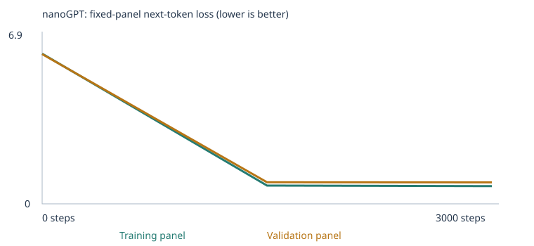
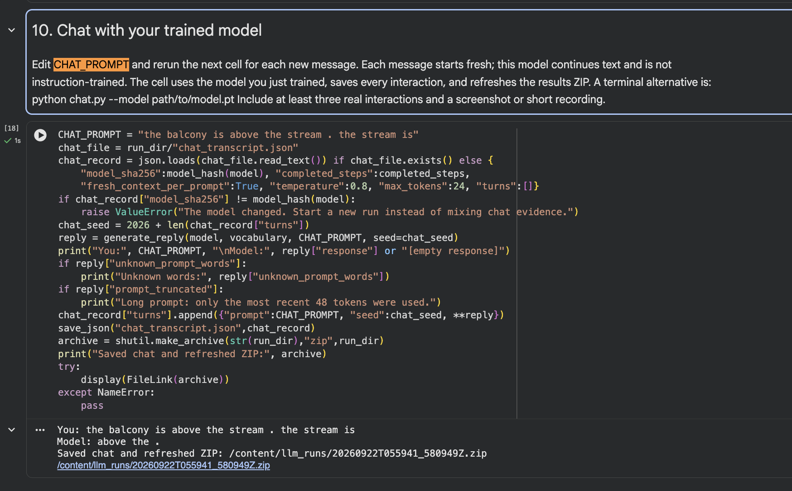
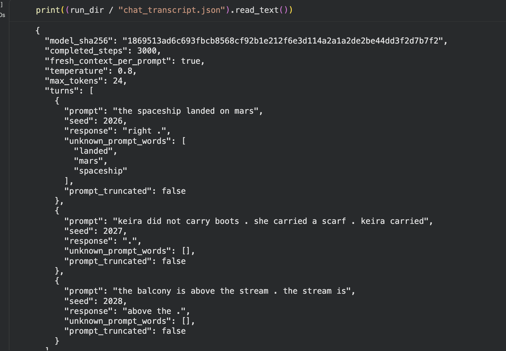

# My Custom nanoGPT Experiment

For this assignment, I trained the provided nanoGPT model from scratch and compared two runs. My first run used only the classroom corpus. For my second run, I added examples for negation and spatial relationships.

This is a tiny word-prediction model, not a general chatbot. My main goal was to see how changing the training data affected loss, generated text, vocabulary coverage, and the fixed language evaluations.

## Main results

| Experiment | Stage | Correct / 48 | Scorable / 48 | Accuracy on scorable cases | Coverage | Results |
|---|---:|---:|---:|---:|---:|---|
| Classroom corpus | Untrained | 9 | 24 | 37.50% | 50.00% | [CSV](results/baseline/language_evals/untrained/eval_results.csv) / [JSON](results/baseline/language_evals/untrained/eval_results.json) / [summary](results/baseline/language_evals/untrained/eval_summary.json) |
| Classroom corpus | Trained | 20 | 24 | 83.33% | 50.00% | [CSV](results/baseline/language_evals/final/eval_results.csv) / [JSON](results/baseline/language_evals/final/eval_results.json) / [summary](results/baseline/language_evals/final/eval_summary.json) |
| Expanded corpus | Untrained | 10 | 26 | 38.46% | 54.17% | [CSV](results/expanded/language_evals/untrained/eval_results.csv) / [JSON](results/expanded/language_evals/untrained/eval_results.json) / [summary](results/expanded/language_evals/untrained/eval_summary.json) |
| Expanded corpus | Trained | 24 | 26 | 92.31% | 54.17% | [CSV](results/expanded/language_evals/final/eval_results.csv) / [JSON](results/expanded/language_evals/final/eval_results.json) / [summary](results/expanded/language_evals/final/eval_summary.json) |

The overall score increased in both runs after training. The expanded model also did better on the new-wording group. However, my added data did not work as well as I expected for the two categories I chose. Only two extension cases were scorable, and all three negation cases were still unscorable. I explain why below.

The `Correct / 48` column is the all-case success measure. The accuracy column uses only cases that were scorable because every prompt and answer-choice word was in the vocabulary. Therefore, the expanded model's 92.31% scorable accuracy means 24 correct answers among 26 scorable cases, not 92.31% of the complete 48-case suite. Its complete-suite result was 24/48, or 50.00%.

## What I chose

I used these settings for both experiments:

- 3,000 training steps
- 0.001 learning rate
- seed 42
- the provided 48-case evaluation suite

I kept the settings the same so that the main planned difference was the corpus.

I chose 3,000 steps because it was the suggested meaningful training budget and was still small enough to complete on a Colab CPU in about one minute. A much smaller run, such as 10 steps, would only verify that the code worked and would not provide enough updates to judge learning. I chose an initial learning rate of 0.001 because it was the recommended starting point for this model and worked with the notebook's warmup and cosine decay. If the learning rate were too large, updates could overshoot useful parameter values and make training unstable. If it were too small, the parameters might change too little to learn the corpus within 3,000 steps.

### Baseline run

The baseline used the supplied classroom corpus without added files. Before training, I expected the model to learn the repeated classroom sentence patterns but fail on extension skills that were not represented in its vocabulary. That is close to what happened. The trained model passed all 16 starter-pattern cases, while all 24 extension cases were unscorable.

### Expanded run

For the second run, I added:

- [68 lines of negation examples](teaching_materials/negation_training_examples.txt)
- [60 lines of spatial-relation examples](teaching_materials/spatial_relations_training_examples.txt)

The notebook split some lines into more than one passage, so the actual import was 88 negation passages plus 90 spatial passages. This added 178 unique passages.

I chose negation because the model needed to separate a rejected statement from a corrected statement. I chose spatial relationships because the model needed to reverse relationships such as above/below and left/right. I used different names, objects, and situations from the evaluation cases.

My prediction was that the added words would make both categories scorable and that training might improve their results. This prediction was only partly correct. Spatial coverage increased to two out of three cases, but negation stayed at zero scorable cases.

The reason was the vocabulary limit. The expanded training text had 543 token types, but the model kept only the 509 most frequent training types. Thirty-four types became `UNK`. Some of those omitted words were needed by the public evaluation, including `yellow`, `milk`, `bread`, `wide`, and `to`. I added too many different low-frequency words instead of keeping the extension corpus focused.

## Data source and permissions

The baseline data came from the supplied notebook. I created and reviewed the two synthetic extension files for this assignment with AI assistance. They do not contain private information or copied documents, and I have permission to publish them.

I used TXT files rather than PDFs, so OCR was not needed. Both files imported without warnings. The [expanded corpus manifest](results/expanded/corpus_manifest.json) records their names, hashes, previews, and passage counts.

I kept the teaching files in `teaching_materials/` in this repository so that a baseline rerun does not accidentally load them. For an expanded rerun, they should be copied into `corpus/` first.

## Run information

| Item | Baseline | Expanded |
|---|---:|---:|
| Executed notebook | [Notebook](notebooks/custom_llm_baseline_classroom_3000_executed.ipynb) | [Notebook](notebooks/custom_llm_expanded_negation_spatial_3000_executed.ipynb) |
| Configuration | [config.json](results/baseline/config.json) | [config.json](results/expanded/config.json) |
| Training summary | [training_summary.json](results/baseline/training_summary.json) | [training_summary.json](results/expanded/training_summary.json) |
| Steps completed | 3,000 | 3,000 |
| Training interrupted | No | No |
| Time | 57.89 seconds | 60.87 seconds |
| Hardware | Colab CPU | Colab CPU |
| Parameters | 111,872 | 135,936 |
| Vocabulary size | 136 | 512 |
| Total unique passages before split | 4,592 | 4,770 |
| Training passages | 4,132 | 4,293 |
| Validation passages | 460 | 477 |
| Training unknown-token rate | 0.00% | 0.07% |
| Validation unknown-token rate | 0.00% | 0.64% |
| Vocabulary report | [JSON](results/baseline/vocabulary_report.json) | [JSON](results/expanded/vocabulary_report.json) |
| Split record | [JSON](results/baseline/split.json) | [JSON](results/expanded/split.json) |

The notebook split the unique passages 90/10. Validation passages did not update the weights. However, the training and validation data still came from the same kinds of sources and templates, so this is not a test on a completely new domain.

## Loss and samples

Loss measures how wrong the model's next-token predictions are. Lower is better. These values came from fixed panels of 20 training and 20 validation passages.

### Baseline loss

| Step | Training loss | Validation loss |
|---:|---:|---:|
| 0 | 4.9263 | 4.9275 |
| 1,500 | 0.6821 | 0.7182 |
| 3,000 | 0.6783 | 0.7061 |


[Baseline history](results/baseline/history.json) and [training CSV](results/baseline/training.csv)

### Expanded loss

| Step | Training loss | Validation loss |
|---:|---:|---:|
| 0 | 6.2436 | 6.2247 |
| 1,500 | 0.7586 | 0.8987 |
| 3,000 | 0.7352 | 0.8919 |



[Expanded history](results/expanded/history.json) and [training CSV](results/expanded/training.csv)

Both loss curves dropped a lot. Validation loss stayed higher than training loss, especially in the expanded run. This means the held-out examples were harder. I do not treat the loss numbers from the two experiments as a direct ranking because their corpora and vocabularies were different.

The table below shows exact excerpts produced with the same saved generation settings. The links contain every saved sample, including garbled output.

| Experiment and stage | Representative actual sample | Full samples |
|---|---|---|
| Baseline, untrained | `pear professor bond doctor course harvest team physician journey checking buyer delivery traffic...` | [step 0](results/baseline/samples/step_0000.txt) |
| Baseline, halfway | `our school has a question about the new educator and lesson .` | [step 1,500](results/baseline/samples/step_1500.txt) |
| Baseline, final | `the report about the nurse explains the health in detail .` | [step 3,000](results/baseline/samples/step_3000.txt) |
| Expanded, untrained | `instructor hill professor traffic select served along closed tire kite code dim harbor...` | [step 0](results/expanded/samples/step_0000.txt) |
| Expanded, halfway | `a review of health helped us understand the different physician .` | [step 1,500](results/expanded/samples/step_1500.txt) |
| Expanded, final | `the local customer was mentioned in the service report yesterday .` | [step 3,000](results/expanded/samples/step_3000.txt) |

Both untrained models produced disconnected vocabulary items. By the halfway checkpoint, both had learned punctuation and repeated classroom sentence structures. The final samples remained locally grammatical within those templates, but the expanded model's free samples still mostly resembled the much larger classroom corpus rather than negation or spatial-relation examples. This is evidence of narrow template learning, not broad language understanding.

## One token and one real update

The [baseline tokenization record](results/baseline/tokenization.json) shows how text was separated into words and punctuation. A token is one of those pieces. A token ID is just its integer lookup address. An embedding is the learned row of 64 numbers stored at that address.

In the baseline run, `customer` had token ID **28**.

<details>
<summary>Customer's full 64-number embedding before and after training</summary>

Before training:

```text
[-0.0575919151, -0.0048099528, 0.0426318869, 0.0193389561, 0.0156431366, -0.0288243648, 0.0256090555, 0.0000524609, 0.0247068163, 0.0206917655, 0.0073690168, -0.0330896154, -0.0535478629, -0.0057429299, -0.0241667628, -0.0147161186, 0.0046857060, -0.0104542682, -0.0083810752, -0.0182585604, -0.0201337002, 0.0050986498, -0.0109165022, -0.0126333516, 0.0283896253, -0.0026312231, -0.0040719286, 0.0136419199, -0.0098917242, -0.0167176239, 0.0019060791, -0.0014535071, 0.0160265211, -0.0056748749, -0.0006723482, -0.0012907272, -0.0073194727, -0.0009307071, 0.0015076200, -0.0049766386, -0.0289870203, 0.0180929881, -0.0073480136, -0.0054402542, 0.0156412050, -0.0045435056, 0.0415679365, 0.0523554347, 0.0226426851, -0.0154142790, -0.0251212027, -0.0067974632, 0.0293527506, -0.0025336796, 0.0298012327, -0.0227970053, -0.0302379131, 0.0064367834, 0.0504908115, 0.0074909981, -0.0107228607, 0.0247373320, -0.0144687248, 0.0132359108]
```

After training:

```text
[0.0366296992, -0.0182185024, 0.1330299377, 0.1059506908, 0.0630148426, 0.0189134274, 0.1523023844, 0.0929090306, -0.0632185191, -0.0172564723, 0.0340957716, -0.0473868959, -0.0645541325, -0.0865872502, -0.1449920833, -0.0358831659, -0.1569090337, -0.1502727568, -0.0076226699, -0.0707449093, -0.0930146873, 0.0091073206, -0.0648097619, 0.0175223872, 0.0039232811, -0.0624555722, 0.1125202551, -0.0643264502, 0.0520459376, -0.1566736698, -0.0706168264, 0.0616783947, -0.0317700915, 0.1413957477, 0.0913106054, 0.0564718805, 0.0196089223, -0.1348370463, 0.1222854555, -0.0338327177, 0.1187400743, 0.0045771315, -0.1344321966, 0.0529430658, -0.0375969820, -0.1031212285, 0.0202728808, 0.0381161012, -0.0198408831, -0.1507370323, 0.0302807782, -0.1205541790, 0.0166181829, 0.0777545646, 0.1180882081, 0.0557370037, 0.0933613256, 0.0026232316, 0.0370569825, 0.0756325200, 0.1185193658, 0.0143766562, 0.0912887752, -0.0746104345]
```

</details>

For the first saved update of coordinate 0:

- value before: `-0.0575919151`
- gradient: `0.0006925865`
- warmup learning rate: `0.00001`
- value after the AdamW update: `-0.0576019064`

The gradient pointed to how the parameter affected the loss. AdamW used that gradient and its running statistics to change the weight. Repeating this process over many batches changed the whole embedding.

The nearest neighbors also became more meaningful. Before training, the five closest cosine neighbors of `customer` were `bus`, `educator`, `helped`, `bank`, and `risk`, with weak similarities around 0.20. After training, they were `shopper`, `client`, `buyer`, `subscriber`, and `consumer`, all above 0.97. These words appeared in similar classroom contexts. The 3D viewer uses PCA, so its picture loses some information; the neighbor calculation uses all 64 dimensions.

For the prefix `the customer`, the untrained top predictions were spread out. The top five were `customer` 1.60%, `bus` 1.07%, `educator` 1.04%, `us` 1.03%, and `application` 1.01%. After training, the top five were classroom-style verbs: `reviewed` 17.82%, `recommended` 17.12%, `ordered` 16.85%, `selected` 16.34%, and `compared` 15.97%.

The complete vectors, probabilities, first update, and attention rows are in [inspection.json](results/baseline/inspection.json).

## What the network is doing

The model first looks up token and position embeddings. Its attention layers combine information from earlier tokens. A causal mask prevents a token from looking at future tokens. Feed-forward layers and other learned weights transform the representations again. The final scores are converted into next-token probabilities.

During training, the model compares its prediction with the actual next token. Loss measures the error. Backpropagation calculates gradients, and AdamW updates the weights. During generation, the model samples one next token and repeats the process.

Temperature only changes sampling. It does not retrain the model. At temperature 0.3, my baseline output was conservative and repeated familiar patterns. At 0.8, it had a little more variety. At 1.2, the expanded run became noticeably noisier and sometimes produced `UNK`. The full samples are in the [baseline](results/baseline/temperature_comparison.json) and [expanded](results/expanded/temperature_comparison.json) temperature files.

## Evaluation details

The fixed suite is [language_evals.json](evals/language_evals.json), and [run_evals.py](run_evals.py) runs it. The runner sends only the prompt to the model. The score checks which of four words has the highest next-token probability. The saved free continuation is separate from this score.

| Result after training | Baseline | Expanded |
|---|---:|---:|
| Starter patterns | 16/16 | 16/16 |
| New wording | 4/8 | 7/8 |
| Entire extension group | 0/24, 0 scorable | 1/24, 2 scorable |
| Negation | 0/3, 0 scorable | 0/3, 0 scorable |
| Spatial relations | 0/3, 0 scorable | 1/3, 2 scorable |

For spatial relations, the expanded model got the inside/contains case right. It missed the above/below case. It could not score the left/right case because `to` was outside the retained vocabulary. I cannot claim that the model learned negation because none of those three cases were scorable.

Full category breakdowns are in the [baseline comparison](results/baseline/language_eval_comparison.json) and [expanded comparison](results/expanded/language_eval_comparison.json). The linked CSV and JSON files at the top of this README keep every case, failure, probability, and free continuation.

## Keeping the evaluations separate

The evaluation suite stayed in `evals/`. I did not put evaluation prompts, answer choices, correct answers, outputs, or chat logs into the training corpus. The notebook also removed reserved classroom prefixes and saved [baseline](results/baseline/eval_separation.json) and [expanded](results/expanded/eval_separation.json) separation records.

I checked my teaching files against all 48 cases. They had no exact evaluation prompt, no matching sequence of four or more prompt tokens, and none of the test-specific entity/answer pairings. Ordinary words and the general language skills overlap because the model needs examples of the concepts. The automated checks only catch exact text, so I also reviewed the files manually.

These evaluations are public and influenced my choice of categories. I treat them as a development benchmark, not as proof of performance on unseen tests.

## Chat demonstration

I used the expanded model from run `20260922T055941_580949Z`. It had completed 3,000 steps, and the transcript identifies the same saved model used by the final evaluation.

| Prompt | Actual response | What I noticed |
|---|---|---|
| `the spaceship landed on mars` | `right .` | Three prompt words were unknown. |
| `keira did not carry boots . she carried a scarf . keira carried` | `.` | Every word was known, but the model did not produce the corrected object. |
| `the balcony is above the stream . the stream is` | `above the .` | Every word was known, but the model failed to reverse the relationship. |

The first screenshot shows the working notebook interface submitting a prompt to the trained expanded model, displaying the generated response, saving the interaction, and refreshing the results ZIP.



The second screenshot shows the complete saved record of all three actual interactions.



The complete [chat transcript](results/expanded/chat_transcript.json) records the prompts, generated responses, seeds, and unknown words. The transcript's model hash matches the expanded model used for the final evaluation. Each prompt starts fresh, so this is not a conversation with memory. The model has a 48-token context limit. Chatting does not retrain it or add messages to the training corpus.

To run the interface with the saved model:

```bash
python -m pip install -r requirements.txt
python chat.py --model results/expanded/model.pt --transcript chat_transcript.json
```

To rerun the evaluations:

```bash
python run_evals.py --model results/expanded/model.pt --output rerun-evals
```

## What I learned

- The corpus determines which vocabulary and patterns the model can learn.
- A token is a piece of text, its ID is a lookup number, and its embedding is a learned vector.
- Lower training loss does not prove generalization. Held-out loss and separate evaluations are also needed.
- The model can learn repeated templates very well without understanding language broadly.
- A larger corpus is not automatically better. My expanded data added too many rare words for the fixed vocabulary size.
- Generated text and multiple-choice next-word scores measure different things.
- A correct narrow answer does not mean the model understands the concept in every wording.

## Limitation and next experiment

My biggest mistake was making the expanded material too vocabulary-heavy. I tried to add variety, but many words appeared only once. The 509-token limit then removed words that mattered for the categories I wanted to test.

For my next experiment, I would use fewer unique nouns and repeat the important negation and inverse-relation patterns in more varied sentence structures. I would keep the same model settings and public tests so that the corpus remains the main change. I would also create a separate unseen test set before training, because improvement on a public development suite is not enough to show generalization.

## How to reproduce the runs

1. Install `requirements.txt` and open [custom_llm.ipynb](custom_llm.ipynb), or open it in Colab.
2. For the baseline run, leave `corpus/` empty except for its README. In particular, remove any earlier copies of the two extension files. Use `CORPUS = "classroom"`, 3,000 steps, and learning rate 0.001.
3. For the expanded run, copy only `negation_training_examples.txt` and `spatial_relations_training_examples.txt` from [teaching_materials](teaching_materials/) into `corpus/`. Keep the same settings and run from a fresh model. From the repository root, the exact setup commands are:

   ```bash
   mkdir -p corpus
   cp teaching_materials/negation_training_examples.txt corpus/
   cp teaching_materials/spatial_relations_training_examples.txt corpus/
   ```

4. Run every notebook cell and download the results ZIP and executed notebook separately.
5. Open [embedding-viewer.html](embedding-viewer.html) locally and load the run's `checkpoint.json` to inspect the embeddings.

After installing the requirements, the corpus and evaluation checks can be run with:

```bash
python -m unittest -v test_language_evals.py test_corpus.py
```

The original downloads are preserved as the [baseline ZIP](results/custom_llm_baseline_classroom_3000_results_20260922T052027Z.zip) and [expanded ZIP](results/custom_llm_expanded_negation_spatial_3000_results_20260922T055941Z.zip).

## Repository contents

- `notebooks/`: both executed notebooks
- `teaching_materials/`: my two extension files
- `results/baseline/` and `results/expanded/`: models and all saved evidence
- `evidence/`: live chat-interface screenshot and complete three-interaction screenshot
- `evals/`: unchanged fixed evaluation suite
- `chat.py` and `run_evals.py`: runnable chat and evaluation tools
